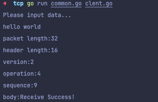
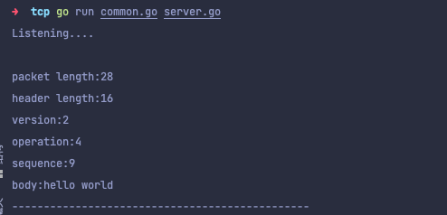

### **粘包拆包发生场景**

因为TCP是面向流，没有边界，而操作系统在发送TCP数据时，会通过缓冲区来进行优化，例如缓冲区为1024个字节大小。

如果一次请求发送的数据量比较小，没达到缓冲区大小，TCP则会将多个请求合并为同一个请求进行发送，这就形成了粘包问题。

如果一次请求发送的数据量比较大，超过了缓冲区大小，TCP就会将其拆分为多次发送，这就是拆包。

### **解决方案**

1. 发送端将每个包都封装成固定的长度，比如100字节大小。如果不足100字节可通过补0或空等进行填充到指定长度；

2. 发送端在每个包的末尾使用固定的分隔符，例如\r\n。如果发生拆包需等待多个包发送过来之后再找到其中的\r\n进行合并；

3. 将消息分为头部和消息体，头部中保存整个消息的长度，只有读取到足够长度的消息之后才算是读到了一个完整的消息；

4. 通过自定义协议进行粘包和拆包的处理。

